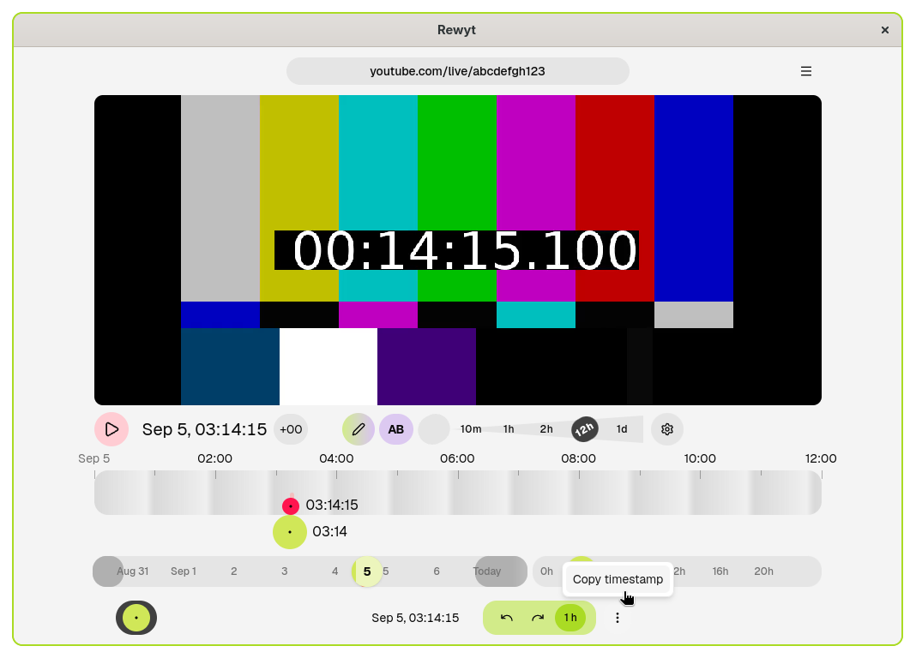
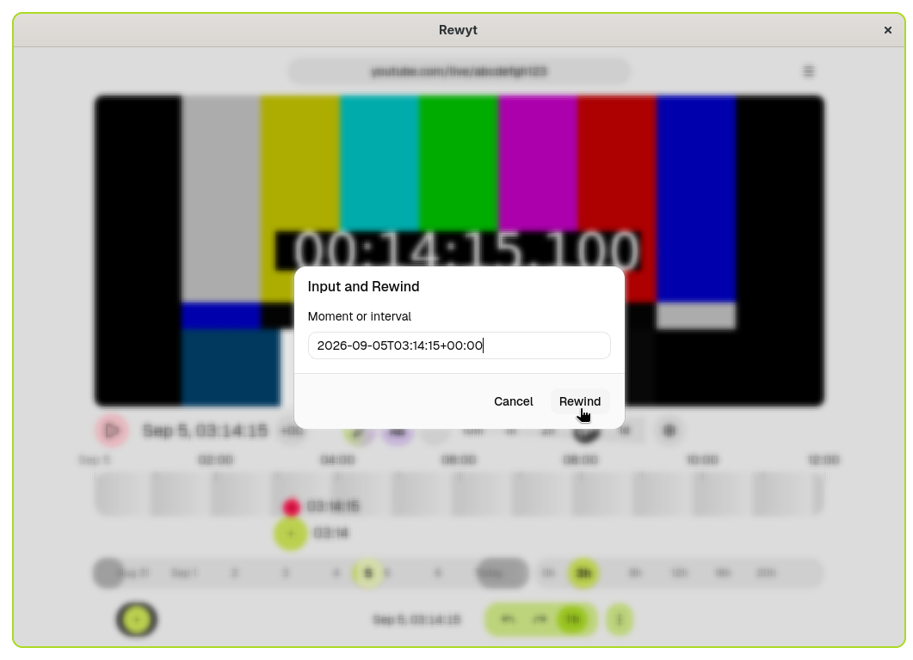

# Share and paste timestamps

This guide shows you how to copy a timestamp from the stream and rewind to a shared one.

## Copy a timestamp

1. **Select a time on the timeline**

   Click on the timeline to rewind to the moment you want to share.

2. **Copy the timestamp**

   Open the **Selected** tab at the bottom of the interface. Click **More**,
   then select **Copy timestamp**. This copies an ISO timestamp to your
   clipboard, for example:

        2026-09-07T03:14:15+00:00

   <figure>
   
   <figcaption aria-hidden="true">Copying the timestamp</figcaption>
   </figure>

Share this timestamp with others so they can jump to the exact same moment.

## Jump to a shared timestamp

1. **Open the Input and rewind dialog**

   Click the **Input and rewind** button in the main bar.

   <figure>
   
   <figcaption aria-hidden="true">Opening the Input and rewind dialog</figcaption>
   </figure>

2. **Paste the timestamp and rewind**

   Paste the ISO timestamp into the input field and click **Rewind**.
   The stream jumps to that moment and starts playing.

   <figure>
   
   <figcaption aria-hidden="true">Inputing the timestamp for rewinding</figcaption>
   </figure>

